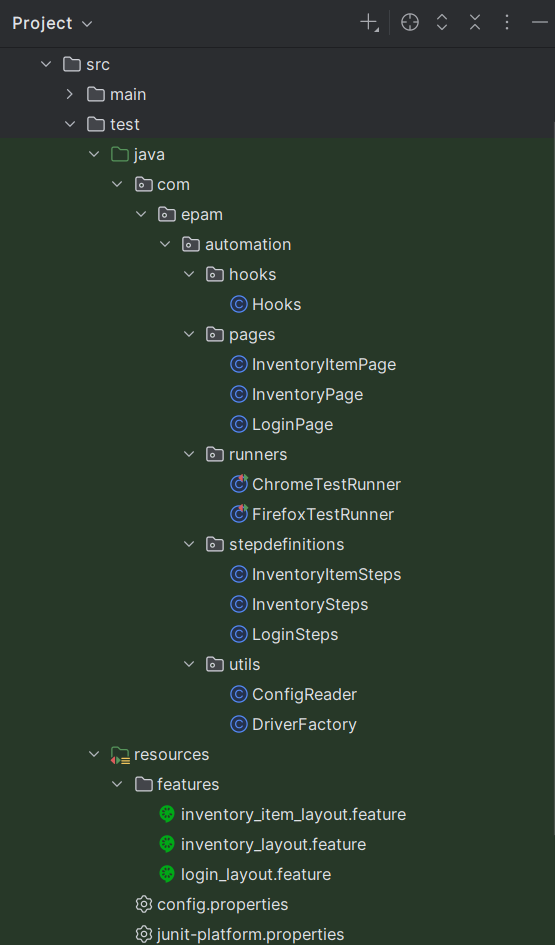

🚀 SauceDemo UI Test Automation Framework

This project is a UI test automation framework built using Java, Selenium, Cucumber (BDD), and JUnit 5.
It validates the UI elements and functionality of the SauceDemo application.

🧰 Tech Stack

Java 17
Selenium WebDriver
Cucumber (BDD)
JUnit 5 (Cucumber JUnit Platform Engine)
WebDriverManager
SLF4J (Logging)
Maven

📁 Project Structure

The project follows a layered test automation architecture including hooks, pages, step definitions, and utilities.

✅ Features Covered

Login Page UI validation
Inventory Page UI validation
Inventory Item Page UI validation

🌐 Cross-Browser Support

Tests can be executed on:
Chrome
Firefox

Browser selection is controlled via system property:
-Dbrowser=chrome
-Dbrowser=firefox

If not provided, the default browser is taken from:
config.properties

⚡ Parallel Execution

Thread-safe driver management using ThreadLocal
Parallel execution supported via IntelliJ Compound Run Configuration

▶️ How to Run Tests 🧪 From IntelliJ

Run one of the runner classes:
ChromeTestRunner
FirefoxTestRunner

Or run both in parallel using Compound Configuration.

🧪 From Maven

mvn test -Dbrowser=chrome
or
mvn test -Dbrowser=firefox

📌 Configuration

Base configurations are stored in:
src/test/resources/config.properties

Example:
baseUrl=https://www.saucedemo.com/
browser=chrome
or
browser=firefox

🧪 BDD Example

Scenario: Verify login page layout elements
Then username field should be visible
And password field should be visible
And login button should be visible
And Swag Labs title should be visible

📊 Logging

Basic logging is implemented using SLF4J.

Example Output:
INFO Hooks - Starting test execution on browser: chrome

⚠️ Notes

Cucumber is integrated with JUnit 5 via "junit-platform.properties".
Maven may show Tests run: 0 — this is expected behavior with Cucumber.
A discovery warning may appear, but it does not affect execution.
In some cases, first scenario log output may not appear.
This is due to Cucumber + JUnit lifecycle behavior.
It does not affect test execution.
And to make it look professional, help was obtained from ChatGPT regarding naming conventions and project structure.

👤 Author
Kutay 🚀